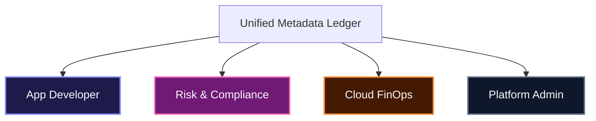

# CxO Product Pitch: TCS Agent Command Center
### *The AI Control Plane as the Anchor for Enterprise AI Governance*

---

```carousel
# 🎯 The Core Tension & Business Problem
### The Trade-off Between Innovation and Control

As organizations scale GenAI initiatives, they face a critical dilemma:
*   **Developers** need speed, frictionless APIs, and raw access to models to innovate.
*   **Enterprises** require strict guardrails around security, compliance (GDPR, EU AI Act), budgets, and runtime safety.

> [!WARNING]
> **The Bottleneck Risk**: Traditional inline API gateways introduce system latency, developer friction, and runtime performance bottlenecks, stalling GenAI adoption.

<!-- slide -->
# 🛡️ The Disruptive Solution
### Separation of Concerns: Governance Without Execution

The **TCS Agent Command Center** decouples the governance layer from the execution layer entirely, acting as an invisible orchestrator.

*   **Invisible Orchestration**: Governs rules of engagement (defines what is allowed, who is allowed, and under what conditions) *without* participating directly in runtime query execution.
*   **Zero-Overhead Latency**: intercepts and audits metadata asynchronously, ensuring compliance checks add **< 2ms of latency** to high-performance client queries.
*   **Unified Metadata Control**: Ingests a single source of shared truth and projects it dynamically across four enterprise personas.

<!-- slide -->
# ⚙️ The Six Pillars of AI Enablement
### Comprehensive Enterprise Guardrails Built on GEAP

| Pillar | GEAP Component | Technical Capability |
| :--- | :--- | :--- |
| **Identity & Access** | Tenant Gateway Auth | Least-privilege IAM controls across tenants, projects, and environments. |
| **Policy Enforcement** | Model Armor | Real-time prompt injection shields, jailbreak filters, and PII masking. |
| **Registration** | Agent Registry | Central inventory of authorized models, autonomous agents, and MCP tools. |
| **Observability** | Compliance Auditor | Cryptographic, tamper-evident audit ledger signed with SHA-256 hashes. |
| **Cost Controls** | Gateway Rate Limiter | Proactive token spending limits and anomaly alerts per tenant. |
| **Intervention** | Runtime Interceptor | Definitive authority to pause, throttle, or terminate workloads instantly. |

<!-- slide -->
# 👥 One Truth, Multiple Perspectives
### Persona-Specific Value Projections



*   **Agent Lifecycle Trace**: Delivers interactive step-by-step lifecycle monitoring, enriched with an **Enterprise Observability Hub** showing task success rates, RAG knowledge hit rates, model distributions, and tool uptime.
*   **Risk & Compliance**: Receives clear regulatory compliance maps (GDPR, EU AI Act), gap detections, and ledger audits.
*   **Cost Tracing & Monitoring**: Captures granular cost details (caching, tool fees, base API) and prevents runaway loops via automated throttle limiters.
*   **Platform Administrator**: Secures a system-wide view of health, latency overhead, active sessions, and runtime kill switches.

<!-- slide -->
# 📈 Key Business Metrics & ROI
### Quantifiable Impact of Decoupled Governance

*   **⚡ < 2ms Latency Overhead**: Parallel governance evaluation prevents runtime friction.
*   **🔒 100% Policy Enforcement**: Instant detection and mitigation of adversarial prompt injections and PII leaks.
*   **💰 Zero Budget Breaches**: Enforces hard budget thresholds, stopping runaway token costs before they occur.
*   **🧾 Tamper-Evident Ledger**: SHA-256 cryptographically signed logs guarantee audit readiness.
```
