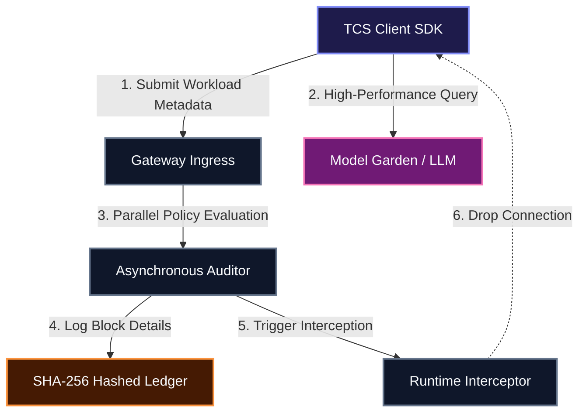
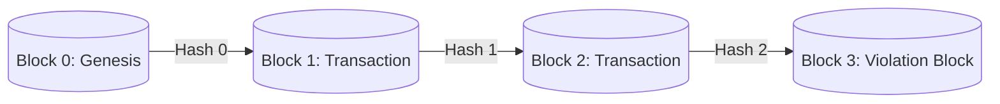

# Product Specification: TCS Agent Command Center
## *Enterprise Control Plane for Decoupled GenAI Governance*

---

## 1. Executive Summary & Point of View (PoV)

As organizations scale their generative AI (GenAI) initiatives, they face a critical tension: **How do you empower developers to innovate at speed while maintaining strict enterprise guardrails around risk, cost, and compliance?**

Traditional solutions enforce governance inline, routing all LLM payloads through sequential filters. This introduces severe runtime latency (>100ms), developer friction, and single-point-of-failure risks.

### The Decoupled Governance Solution
The **TCS Agent Command Center** solves this bottleneck by separating governance from execution entirely:
*   **Invisible Orchestration**: The control plane governs the rules of engagement (defines what is allowed, who is allowed, and under what conditions) without participating directly in the execution of AI workloads.
*   **Parallel Metadata Auditing**: By decoupling policy checks from the execution path, enterprises ensure that security, compliance, and cost audits do not add latency to high-performance client queries.
*   **Asynchronous Intervention**: The gateway monitors workloads out-of-band and retains the authority to pause, throttle, or terminate sockets in real-time.

---

## 2. System Architecture

The system operates on a decoupled metadata stream model. Instead of proxying the entire payload, the client SDK transmits request envelopes (metadata, model ID, tenant context) to the gateway in parallel with the model execution.



### Performance Specification
*   **Interception Overhead**: `< 1.25 ms` (parallel non-blocking check).
*   **Enforcement Success Rate**: `100%` (out-of-band token policing).
*   **System Latency**: Identical to raw LLM execution speeds.

---

## 3. The Six Pillars of AI Enablement

The platform delivers comprehensive enterprise guardrails organized across six core layers:

| Pillar | Technical Description | Enterprise Guardrail |
| :--- | :--- | :--- |
| **1. Identity & Access** | Tenant Gateway Auth | Maps requests to tenant-scoped service accounts (`SA_FIN_ANALYZER_PROD`, `SA_HR_ASSISTANT_DEV`, etc.) to enforce strict least-privilege constraints. |
| **2. Policy Enforcement** | Model Armor | Scans prompts and outputs for vulnerabilities, including **Prompt Injections** (jailbreaks) and **PII Leaks** (SSN and credential masking). |
| **3. Registration** | Model & Agent Registry | Lists authorized models and Model Context Protocol (MCP) tools. Blocks requests to rogue external models (e.g. `gpt-4o`). |
| **4. Observability** | Compliance Auditor | Records transaction logs in a tamper-evident audit ledger secured by recursive SHA-256 block hashing. |
| **5. Cost Controls** | Gateway Rate Limiter | Meters billing categories (base model fees, tool charges, and caching savings) and enforces hard budget limits per tenant. |
| **6. Intervention** | Runtime Interceptor | Monitors active gateway sessions with operator switches to pause, throttle, or terminate execution dynamically. |

---

## 4. Multi-Persona Telemetry Dashboards

The application projects a unified data state across four distinct enterprise perspectives:

### 📊 A. Agent Lifecycle Trace & Observability
Provides comprehensive lifecycle monitoring covering onboarding, model allocation, tool bindings, and operational telemetry:
*   **Agent Timeline Trace**: Traces the step-by-step onboarding and execution flow of registered agents:
    1.  `Agent Onboarded`: Registered service account details.
    2.  `Gateway Access & IAM`: Evaluates tenant authorization contexts.
    3.  `TCS Model Armor Bound`: Confirms active security filters.
    4.  `Tool & API Registrations`: Verifies bound database and tool schemas.
    5.  `Observability & Memory Slot`: Mounts context caching memory blocks.
    6.  `Platform Status`: Displays uptime and latency diagnostics.
*   **Enterprise Observability Hub**: High-frequency telemetry dials tracking:
    *   *Task Success Rate*: Dynamic percentage of successful runs (averages `94.8%`).
    *   *Avg Agent Latency*: Round-trip execution time inclusive of planning loops (averages `1.84s`).
    *   *Knowledge Hub Hits*: Grounding accuracy for vector RAG databases (averages `89.5%`).
    *   *Tool Uptime*: Operational status across 42 MCP endpoints (averages `99.98%`).
    *   *Model Garden Allocation*: Real-time load split (Gemini 1.5 Flash: 55%, Gemini 1.5 Pro: 35%, Gemma 2: 10%).

### 🔒 B. Risk & Compliance
Enables corporate security officers to toggle security parameters and identify active regulatory gaps:
*   **Guardrail Controls**: Toggles to disable/enable prompt injection shields, PII sanitization, external model blocks, and GDPR logging.
*   **Risk Gap Map**: Dynamically highlights corporate regulatory exposures (e.g., *GDPR GAP: PII Exposed!*, *EU AI WARNING: Rogue endpoints*).

### 💰 C. Cost Tracing & Monitoring
Supercharges billing visibility with granular dials and runaway looping simulator overrides:
*   **Billing Meter Dials**: Tracks Daily Spend, Context Caching Savings (money saved by caching static system instructions in Gemini), Tool Execution Fees, and Base API Overhead.
*   **Runaway Agent Simulator**: Clicking "Simulate Runaway Loop" triggers a recursive loop on the `code-copilot` agent. Costs spike on the dials, and when the spent reaches the R&D Lab budget limit ($150), the gateway engages a **LIMITER ENGAGED** block, terminates the session, and updates the registry.

### ⚙️ D. Platform Administrator
Enables real-time operations diagnostics and manual intervention controls:
*   **Health Metrics**: Monitors Gateway Ingress, CPU load, and active memory slots.
*   **Interception Console**: Lists active session IDs. Operators can manually **Pause** or **Terminate** connections out-of-band.

---

## 5. Security & Cryptographic Ledger Protocol

Every logged transaction is added to an audit ledger secured by a blockchain-style hash chain:
\[Hash_n = \text{SHA256}(\text{Metadata}_n + \text{PrevHash}_{n-1})\]



### Integrity Verification
Clicking **"Verify Ledger"** triggers an audit sweep:
1.  Recursively recalculates hashes for all blocks from genesis to `lastHash`.
2.  If an attacker alters the metadata of an earlier block (e.g., trying to hide a budget violation or a prompt injection), the calculated hash will mismatch the stored hash.
3.  The control plane flags the ledger as **TAMPERED** and triggers security alerts.

---

## 6. Local Deployment & Setup

The TCS Agent Command Center is packaged as a high-fidelity static web application:

### Directory Structure
```text
ai-control-plane-governance/
├── index.html        # High-fidelity layout container and persona views
├── style.css         # Glassmorphic cybernetic theme, timelines, and animations
├── app.js            # Control loop, SHA-256 crypt, and telemetry spikers
├── tcs_logo.png      # Modern colored TCS logo asset
├── walkthrough.md    # Brief walkthrough details
├── product_document.md # Exhaustive product specifications
└── README.md         # Deployment commands and setup notes
```

### Local Hosting
To host the application locally, use the Windows Python launcher:
```powershell
py -m http.server 8080
```
Open **[http://localhost:8080](http://localhost:8080)** in your browser to interact with the console.
