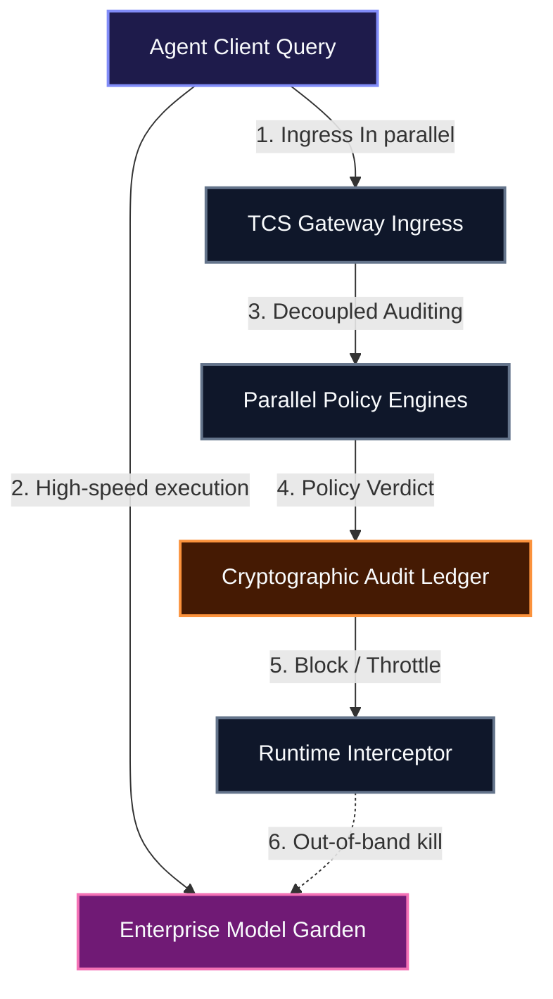

# Walkthrough & Product Details - TCS Agent Command Center
### *Decoupled Control Plane for Enterprise GenAI Governance*

The **TCS Agent Command Center** is a high-fidelity enterprise AI governance console. It demonstrates the technical PoV of **Separation of Concerns: Governance Without Execution**, separating policy checks from the execution runtime to eliminate friction, maintain developer agility, and ensure compliance without latency overhead.

---

## 🏗️ Architecture & Core Philosophy

Traditional inline API gateways evaluate safety policies sequentially, adding substantial latency overhead (often >100ms) to every user prompt. The **TCS Agent Command Center** introduces a decoupled architecture:



*   **Asynchronous Auditing**: Prompt metadata and access policies are processed in parallel with the LLM workload ingress.
*   **Decoupled Policy Engine**: Safety audits and budget checks run asynchronously, resulting in **< 1.25ms of gateway overhead**.
*   **Out-of-band Interception**: The gateway has direct authority to throttle or drop connections out-of-band if violations are detected.

---

## ⚡ The Six Pillars of AI Enablement

The platform implements six key governance capabilities, mapped directly to Google's Gemini Enterprise Agent Platform (GEAP) taxonomy:

```carousel
# 🔑 1. Identity & Access
### Secure Gateway Authentication
*   **Mechanism**: Implements tenant-scoped service accounts (`SA_FIN_ANALYZER_PROD`, `SA_HR_ASSISTANT_DEV`, etc.).
*   **Role**: Enforces least-privilege scoping, ensuring that an agent bound to a specific tenant context cannot query unrelated database tables or invoke unauthorized APIs.

<!-- slide -->
# 🛡️ 2. Policy Enforcement
### Dynamic Model Armor Shields
*   **Mechanism**: Background prompt sanitizers.
*   **Role**: Prevents OWASP GenAI Top 10 vulnerabilities, specifically **Prompt Injections** (jailbreak prompts) and **PII Leakage** (sensitive data masking such as SSNs and email addresses).
*   **Toggles**: Administrators can dynamically disable or enable shields, which registers compliance gaps in the risk map.

<!-- slide -->
# 🗃️ 3. Registration
### Enterprise Model Garden Registry
*   **Mechanism**: A centralized directory of approved foundation models (Gemini 1.5 Pro, Flash, Gemma 2) and connected Model Context Protocol (MCP) tools.
*   **Role**: Blocks rogue model requests (e.g. external unauthorized models like `gpt-4o`) and restricts tool execution to verified endpoints.

<!-- slide -->
# 👁️ 4. Observability
### Cryptographic Tamper-Evident Ledger
*   **Mechanism**: Recursively calculated SHA-256 block hash chain (blockchain-style).
*   **Role**: Every transaction, block, or policy modification is hashed along with the previous block's hash. A single-click ledger verification sweep detects retroactive tampering instantly.

<!-- slide -->
# 💰 5. Cost Controls
### Granular Token & Tool Billing Controls
*   **Mechanism**: Category dials tracing Base API costs, context caching savings, and MCP tool execution fees, paired with tenant budget limiters.
*   **Role**: Enforces hard budget limits. Features a runaway agent simulator showing auto-throttling when a looping script threatens to spike costs.

<!-- slide -->
# 🛑 6. Runtime Intervention
### Real-Time In-Flight Session Controls
*   **Mechanism**: In-flight workload interception.
*   **Role**: Administrators inspect active gateway sessions and can inject throttle commands, pause execution, or terminate sockets instantly to mitigate active threats.
```

---

## 👥 Multi-Persona Telemetry Dashboards

The application projects a unified data state across four specialized administrative perspectives:

### 1. Agent Lifecycle Trace & Observability
This dashboard provides deep observability across the entire agentic lifecycle—from onboarding to decommission:
*   **Agent Timeline Trace**: Interactive flow displaying step-by-step verification steps (Onboarding $\rightarrow$ Gateway Credentials Check $\rightarrow$ Model Armor Shield Ingestion $\rightarrow$ MCP Tool Registration $\rightarrow$ Context Caching Allocation $\rightarrow$ Platform Operational Status).
*   **Enterprise Observability Hub**: Live telemetry dials tracing:
    *   *Task Success Rate*: Successful agent completions (averages **94.8%**).
    *   *Avg Agent Latency*: Average round-trip execution duration (averages **1.84s**).
    *   *Knowledge Hub Hits*: Grounding accuracy hit rate for vector RAG databases (averages **89.5%**).
    *   *Tool Uptime*: Operational status of connected tools (averages **99.98%**).
    *   *Active Models & Integrations*: Identifies request load split across Gemini 1.5 Pro, Flash, and Gemma 2.

### 2. Risk & Compliance
Enables corporate security officers to govern model safety:
*   **Safety Switch Console**: Toggles for Prompt Injection, PII Masking, External Model Registry, and GDPR Audit logging.
*   **Risk Gap Map**: Dynamically renders visual alerts (e.g. *GDPR GAP*, *VULNERABLE*) when compliance standards are breached.

### 3. Cost Tracing & Monitoring
Provides maximum cost tracking and guardrail simulations:
*   **Granular Billing Dial Card**: Visualizes Daily Spend, Tool Fees, Base Model API charges, and **Cached Savings** (money saved by caching static system instructions in Gemini).
*   **Runaway Agent Simulator**: Clicking this button starts an infinite execution loop on `code-copilot` to simulate a runaway script. Costs spike on the dials, and when R&D spent hits the limit ($150), the control plane automatically triggers a **LIMITER ENGAGED** block, terminates the session, and logs the intervention.

### 4. Platform Administrator
Enables real-time operations diagnostics:
*   **System Health Telemetry**: CPU load, Active memory slots, and Model Armor latency.
*   **Gateway Sessions Registry**: Lists active agent sessions. Admin buttons allow operators to **Pause** or **Terminate** any running query, writing a warning or drop flag to the cryptographic audit trail.

---

## 🔐 Cryptographic Ledger Verification Protocol

Every transaction recorded in the SecOps feed is secured using a SHA-256 hash chain:
\[Hash_n = \text{SHA256}(\text{Metadata}_n + \text{PrevHash}_{n-1})\]

This mathematical coupling ensures that if an attacker retroactively changes the details of Block 3, the hash of Block 3 will change. This invalidates the `prevHash` stored in Block 4, triggering a chain breakage. Clicking the **"Verify Ledger"** button triggers an asynchronous recalculation sweep across the entire chain to guarantee the integrity of the audit trails.
